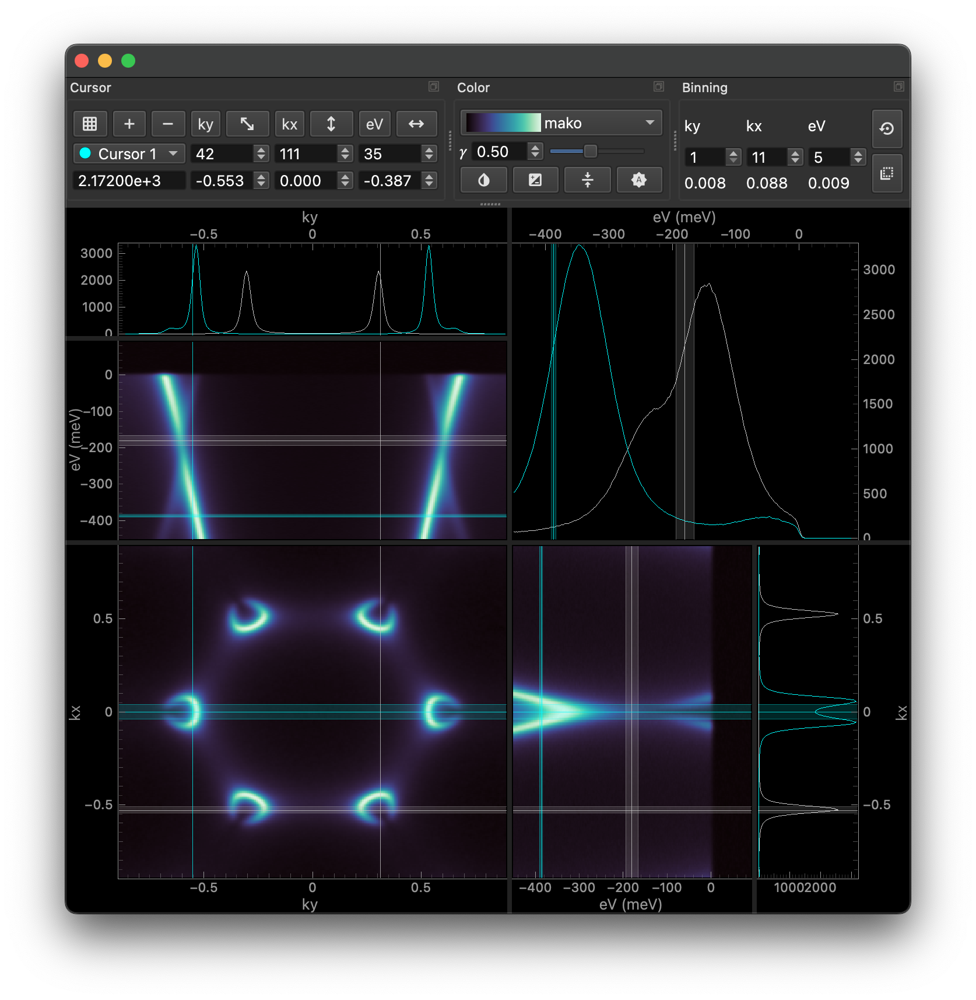

#######
ERLabPy
#######

.. only:: format_html

   Last updated |today|

   .. image:: https://img.shields.io/pypi/pyversions/erlab
       :target: https://pypi.org/project/erlab/
       :alt: Supported Python Versions
   .. image:: https://img.shields.io/pypi/v/erlab.svg
       :target: https://pypi.org/project/erlab/
       :alt: PyPi
   .. image:: https://github.com/kmnhan/erlabpy/actions/workflows/release.yml/badge.svg
       :target: https://github.com/kmnhan/erlabpy/actions/workflows/release.yml
       :alt: Workflow Status
   .. image:: https://readthedocs.org/projects/erlabpy/badge/?version=latest
       :target: https://erlabpy.readthedocs.io/en/latest/
       :alt: Documentation Status
   .. image:: https://img.shields.io/endpoint?url=https://raw.githubusercontent.com/astral-sh/ruff/main/assets/badge/v2.json
       :target: https://github.com/astral-sh/ruff
       :alt: Ruff
   .. image:: https://results.pre-commit.ci/badge/github/kmnhan/erlabpy/main.svg
       :target: https://results.pre-commit.ci/latest/github/kmnhan/erlabpy/main
       :alt: pre-commit.ci status

A library that provides a set of tools and utilities to handle, manipulate, and
visualize data from condensed matter physics experiments, with a focus on
angle-resolved photoemission spectroscopy (ARPES).

.. grid:: 1 1 2 2
    :gutter: 2

    .. grid-item-card:: Getting started
        :link: getting-started
        :link-type: doc

         The getting started guide provides installation instructions and an
         overview on the dependencies.

    .. grid-item-card::  User guide
        :link: userguide
        :link-type: doc

         The user guide provides some tutorials and examples on how to use
         ERLabPy.

    .. grid-item-card::  API reference
        :link: reference
        :link-type: doc

         The reference guide provides detailed information of the API, including
         descriptions of most available methods and parameters.

    .. grid-item-card::  Development guide
        :link: development
        :link-type: doc

         The development guide contains information on how to contribute to the
         project.

.. image:: images/imagetool_light.png
    :align: center
    :alt: Imagetool
    :class: only-light

.. toctree::
   :maxdepth: 3
   :hidden:
   :caption: Contents

   getting-started
   userguide
   reference
   development
   bibliography
