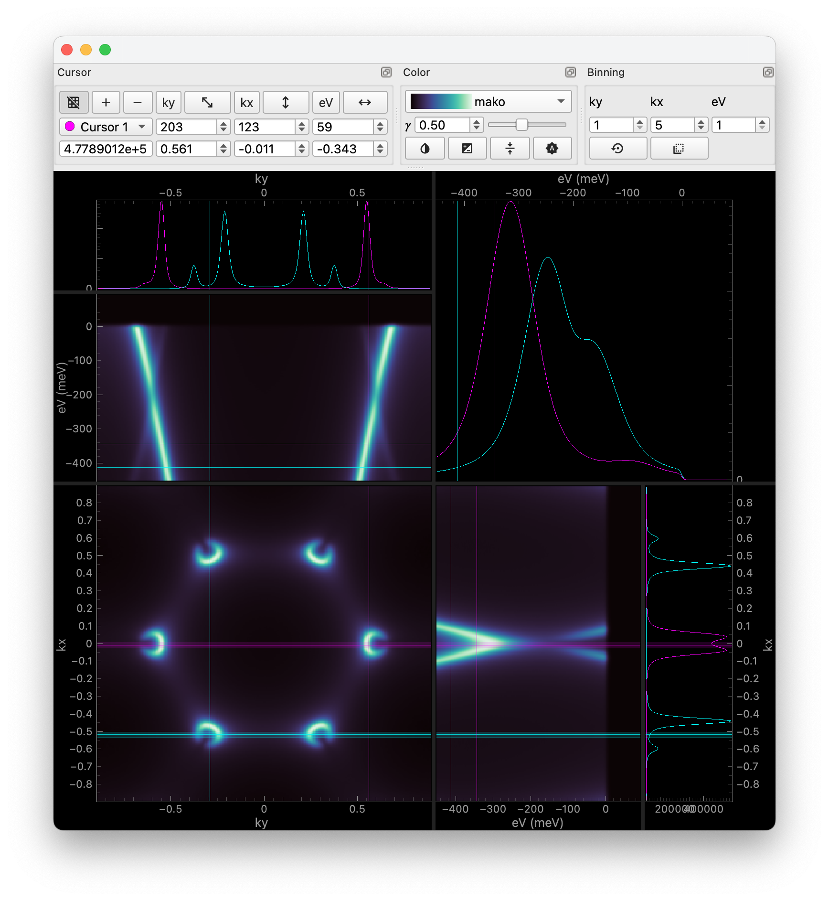

Using ImageTool
===============

.. only:: format_html

    .. image:: ../images/imagetool_dark.png
        :align: center
        :alt: Imagetool
        :class: only-dark

Inspired by *Image Tool* for Igor Pro written by the Advanced Light Source at Lawrence
Berkeley National Laboratory, :class:`ImageTool <erlab.interactive.imagetool.ImageTool>`
is a simple tool for interactively exploring images.

Features include:

- Zooming and panning
- Extremely fast and smooth data exploration
- Real-time binning across multiple dimensions
- Multiple cursors!
- Easy and intuitive plot size adjustment with splitters
- Advanced colormap control

ImageTool can be used to display *image-like* :class:`xarray.DataArray`\ s ranging from
2 to 4 dimensions. If a coordinate of the input data happens to be non-uniform, it will
automatically be converted to an index array so that the data can be displayed.

There are two main ways to invoke the ImageTool. The first way is to call the
:func:`itool <erlab.interactive.imagetool.itool>` convenience function, which will
create a new ImageTool instance and handle the event loop execution: ::

    import erlab.interactive as eri
    eri.itool(data)

Another way is to use the :class:`qshow
<erlab.accessors.utils.InteractiveDataArrayAccessor>` accessor: ::

    data.qshow()

Tips
----

- If you don't know what a button does, many buttons have tooltips that will appear when
  you hover over them.

- Right-clicking on each plot will bring up a context menu with various options. One
  useful menu is ``Copy selection code`` that copies the selection code which can be
  quickly pasted to a Python script or Jupyter notebook to reproduce the data in the
  clicked region.

- ImageTool is also very extensible. At our home lab, we use a modified version of
  ImageTool to plot data as it is being collected in real-time!

Keyboard shortcuts
------------------

Hints for most keyboard shortcuts are displayed in the menu bar. Here, some shortcuts
that are not found in the menu bar are listed. Mac users must replace :kbd:`Ctrl` with
:kbd:`⌘` and :kbd:`Alt` with :kbd:`⌥`.

The rule of thumb is that if you can do something that applies to a single cursor, you
can do it to all cursors by holding :kbd:`Alt`. Also, keyboard shortcuts that are
related to 'shifting' a cursor usually involves holding :kbd:`Shift`.

.. list-table::
    :header-rows: 1

    * - Shortcut
      - Description
    * - :kbd:`LMB` Drag
      - Pan around
    * - :kbd:`RMB` Drag
      - Zoom and scale
    * - :kbd:`Ctrl+LMB` Drag
      - Move current cursor around
    * - :kbd:`Ctrl+Alt+LMB` Drag
      - Move all cursors around
    * - :kbd:`Alt` while dragging a cursor line
      - Make all cursor lines move together

Using the ImageTool manager
---------------------------
One drawback of using interactive tools with Jupyter notebooks is that the tool will be
a blocking call. This means that you cannot run any other code while the tool is
running. To get around this, you can use the :class:`ImageToolManager
<erlab.interactive.imagetool.ImageToolManager>`.

In the environment where ERLabPy installed, run ``itool-manager`` in a shell to start
the manager application. Subsequent invocations with :func:`itool
<erlab.interactive.imagetool.itool>` and :class:`qshow
<erlab.accessors.utils.InteractiveDataArrayAccessor>` will be handled by the manager.

.. note::

  - The manager is designed to be global, so you can only have one manager running on a
    single machine that will handle all ImageTool instances opened from different
    notebooks.

  - Opening in the manager has a slight delay compared to opening directly from the
    notebook. The delay is bigger for larger data. You can still open directly while the
    manager is running by providing the `use_manager=False` argument to :func:`itool
    <erlab.interactive.imagetool.itool>` or :class:`qshow
    <erlab.accessors.utils.InteractiveDataArrayAccessor>`.
